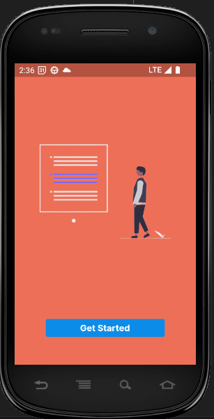
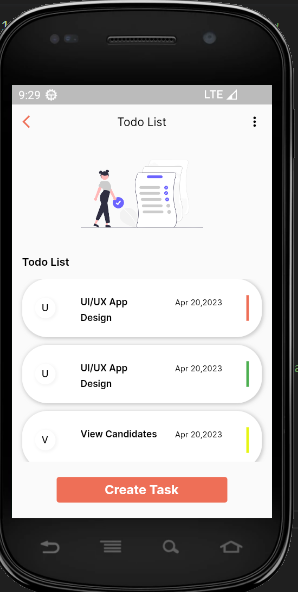
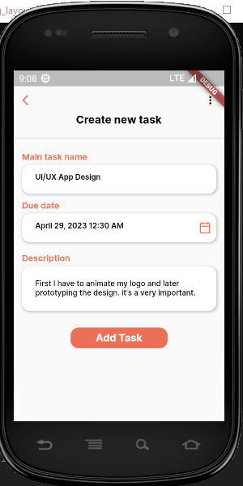
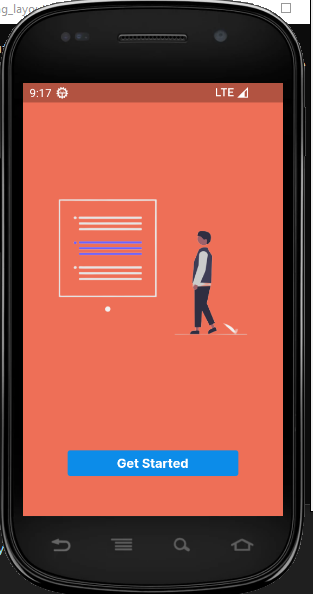

# Onboarding Page Test:

```dart

// Test case to verify that tapping the "Get Started" button on the OnboardingPage
  // navigates to the TodoListPage and checks for specific elements on the page.
  testWidgets("Tapping the Get Started button will navigate to TodoListPage",
      (tester) async {
    await tester.pumpWidget(
      ScreenUtilInit(
          designSize: const Size(390, 844),
          builder: (_, __) {
            return const MaterialApp(
              home: OnboardingPage(),
            );
          }),
    );

    expect(find.byType(ElevatedButton), findsOneWidget);
    final findsButton = find.byType(ElevatedButton);
    await tester.tap(findsButton);
    await tester.pumpAndSettle();
    // Verifies that the TodoListPage is present exactly once on the screen.
    expect(find.byType(TodoListPage), findsOneWidget);
  });

```

# Task List Page Test:

```dart

// Test case to verify the elements on the TodoListPage.
  testWidgets('Todo List Page Test', (WidgetTester tester) async {
    await tester.pumpWidget(
      ScreenUtilInit(
          designSize: const Size(390, 844),
          builder: (_, __) {
            return const MaterialApp(
              home: TodoListPage(),
            );
          }),
    );

    // Verifies that the text "Todo List" appears twice on the TodoListPage.
    expect(find.text('Todo List'), findsNWidgets(2));

    // // Verifies that there is exactly one GestureDetector widget on the TodoListPage.
    // expect(find.byType(GestureDetector), findsNWidgets(4));

    expect(
        find.byKey(const ValueKey("todoListPageTodoTitle0")), findsOneWidget);
    expect(find.byKey(const ValueKey("todoListPageTodoDeadline0")),
        findsOneWidget);

    // Verifies that the text "Create Task" appears once on the TodoListPage.
    expect(find.text('Create Task'), findsOneWidget);
  });

```

# Update Task Page Test:

```dart


  // Test cases to verify elements on the UpdateTodoPage
  testWidgets('Update Todo Page Test', (WidgetTester tester) async {
    await tester.pumpWidget(
      ScreenUtilInit(
        designSize: const Size(390, 840),
        builder: (_, __) {
          return const MaterialApp(
            home: TodoListPage(),
          );
        },
      ),
    );
    // Verify that tapping one of the todo from the todo list page will redirect to task detail page
    await tester.tap(find.byKey(const ValueKey("todoListPageTodoTitle0")));
    await tester.pumpAndSettle();
    // Verify that there is exactly one TaskDetailPage widget
    expect(find.byType(TaskDetailPage), findsOneWidget);
    // Verifies that there are exactly three TextField widgets on the UpdateTodoPage.
    expect(find.byType(TextField), findsNWidgets(3));

    // verify that the TaskDetailPage contains the title of the todo passed from the todo list page
    expect(find.text(TodoController.todos[0].title), findsOneWidget);

    // Verifies that the text "Update Task" appears once on the UpdateTodoPage.
    expect(find.text('Update Task'), findsOneWidget);

    // Verify that "Description" appear once on the UpdateTodoPage
    expect(find.text('Description'), findsOneWidget);
  });
```

# Create Task Page Test:

```dart

 // Test case to verify the elements on the AddTaskPage.
  testWidgets('Add Task page test', (WidgetTester tester) async {
    await tester.pumpWidget(
      ScreenUtilInit(
        designSize: const Size(390, 840),
        builder: (_, __) {
          return const MaterialApp(
            home: AddTaskPage(),
          );
        },
      ),
    );

    // Verifies that there are exactly three TextField widgets on the AddTaskPage.
    expect(find.byType(TextField), findsNWidgets(3));

    // Verifies that the text "Add Task" appears once on the AddTaskPage.
    expect(find.text('Add Task'), findsOneWidget);

    // Verify that "Description" appear once on the AddTaskPage
    expect(find.text('Description'), findsOneWidget);
  });

```
