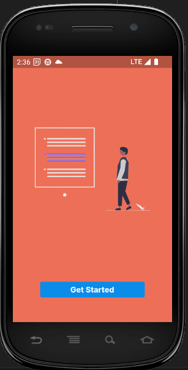
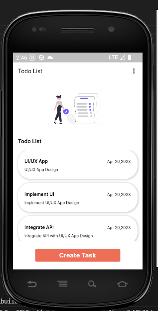
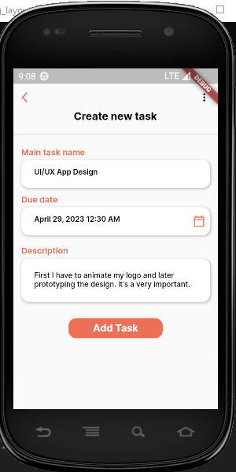
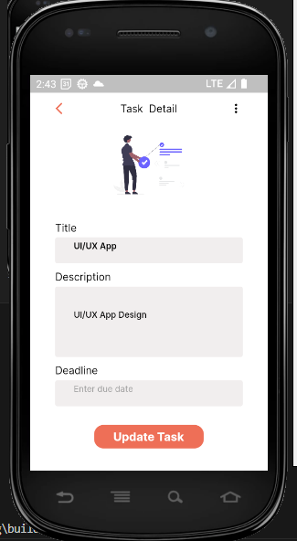
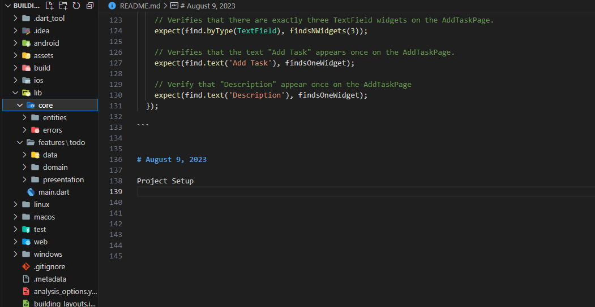

# Onboarding Page Test:

```dart

// Test case to verify that tapping the "Get Started" button on the OnboardingPage
  // navigates to the TodoListPage and checks for specific elements on the page.
  testWidgets("Tapping the Get Started button will navigate to TodoListPage",
      (tester) async {
    await tester.pumpWidget(
      ScreenUtilInit(
          designSize: const Size(390, 844),
          builder: (_, __) {
            return const MaterialApp(
              home: OnboardingPage(),
            );
          }),
    );

    expect(find.byType(ElevatedButton), findsOneWidget);
    final findsButton = find.byType(ElevatedButton);
    await tester.tap(findsButton);
    await tester.pumpAndSettle();
    // Verifies that the TodoListPage is present exactly once on the screen.
    expect(find.byType(TodoListPage), findsOneWidget);
  });

```

# Task List Page Test:

```dart

// Test case to verify the elements on the TodoListPage.
  testWidgets('Todo List Page Test', (WidgetTester tester) async {
    await tester.pumpWidget(
      ScreenUtilInit(
          designSize: const Size(390, 844),
          builder: (_, __) {
            return const MaterialApp(
              home: TodoListPage(),
            );
          }),
    );

    // Verifies that the text "Todo List" appears twice on the TodoListPage.
    expect(find.text('Todo List'), findsNWidgets(2));

    // // Verifies that there is exactly one GestureDetector widget on the TodoListPage.
    // expect(find.byType(GestureDetector), findsNWidgets(4));

    expect(
        find.byKey(const ValueKey("todoListPageTodoTitle0")), findsOneWidget);
    expect(find.byKey(const ValueKey("todoListPageTodoDeadline0")),
        findsOneWidget);

    // Verifies that the text "Create Task" appears once on the TodoListPage.
    expect(find.text('Create Task'), findsOneWidget);
  });

```

# Update Task Page Test:

```dart


  // Test cases to verify elements on the UpdateTodoPage
  testWidgets('Update Todo Page Test', (WidgetTester tester) async {
    await tester.pumpWidget(
      ScreenUtilInit(
        designSize: const Size(390, 840),
        builder: (_, __) {
          return const MaterialApp(
            home: TodoListPage(),
          );
        },
      ),
    );
    // Verify that tapping one of the todo from the todo list page will redirect to task detail page
    await tester.tap(find.byKey(const ValueKey("todoListPageTodoTitle0")));
    await tester.pumpAndSettle();
    // Verify that there is exactly one TaskDetailPage widget
    expect(find.byType(TaskDetailPage), findsOneWidget);
    // Verifies that there are exactly three TextField widgets on the UpdateTodoPage.
    expect(find.byType(TextField), findsNWidgets(3));

    // verify that the TaskDetailPage contains the title of the todo passed from the todo list page
    expect(find.text(TodoController.todos[0].title), findsOneWidget);

    // Verifies that the text "Update Task" appears once on the UpdateTodoPage.
    expect(find.text('Update Task'), findsOneWidget);

    // Verify that "Description" appear once on the UpdateTodoPage
    expect(find.text('Description'), findsOneWidget);
  });
```

# Create Task Page Test:

```dart

 // Test case to verify the elements on the AddTaskPage.
  testWidgets('Add Task page test', (WidgetTester tester) async {
    await tester.pumpWidget(
      ScreenUtilInit(
        designSize: const Size(390, 840),
        builder: (_, __) {
          return const MaterialApp(
            home: AddTaskPage(),
          );
        },
      ),
    );

    // Verifies that there are exactly three TextField widgets on the AddTaskPage.
    expect(find.byType(TextField), findsNWidgets(3));

    // Verifies that the text "Add Task" appears once on the AddTaskPage.
    expect(find.text('Add Task'), findsOneWidget);

    // Verify that "Description" appear once on the AddTaskPage
    expect(find.text('Description'), findsOneWidget);
  });

```

# August 9, 2023

Project Setup:



TodoEntity Implementation:

```dart
class TodoEntity extends Equatable {
  final String id;
  final String title;
  final String description;
  final bool isCompleted;

  const TodoEntity(
      {required this.id,
      required this.title,
      required this.description,
      required this.isCompleted});

  @override
  List<Object?> get props => [id, title, description, isCompleted];
}

```

Implement Models:

```dart
class TodoModel extends TodoEntity {
 const TodoModel(
     {required id, required title, required description, required isCompleted})
     : super(
           id: id,
           title: title,
           description: description,
           isCompleted: isCompleted);

 factory TodoModel.fromJson(Map<String, dynamic> json) {
   return TodoModel(
       id: json['id'],
       title: json['title'],
       description: json['description'],
       isCompleted: json['isCompleted']);
 }

 Map<String, dynamic> toJson() {
   return {
     "id": id,
     "title": title,
     "description": description,
     "isCompleted": isCompleted
   };
 }
}

// TodoMode Test:
void main() {
 TodoModel tTodoModel = const TodoModel(
     id: "1",
     title: "Task 8",
     description: "complete day 8 task",
     isCompleted: false);

 test("should be a subclass of TodoEntity", () async {
   //assert
   expect(tTodoModel, isA<TodoEntity>());
 });

 // test fromJson
 test("should return valid TodoModel from json", () async {
   // arrange
   final Map<String, dynamic> jsonMap = await jsonDecode(
       readJson("features/todo/helpers/dummy_data/todo_dummy_response.json"));

   // act
   final result = TodoModel.fromJson(jsonMap);

   // assert
   expect(result, equals(tTodoModel));
 });

 // test toJson
 test("should return valid json from TodoModel", () async {

   final result = tTodoModel.toJson();


   final expectedJsonMap = {
     "id": "1",
     "title": "Task 8",
     "description": "complete day 8 task",
     "isCompleted": false
   };

   //assert
   expect(result, equals(expectedJsonMap));
 });
}
```


# August 10, 2023

Contract and Repository:

```dart

abstract class TodoRepository {
  Future<Either<Failure, TaskEntity>> createTask(TaskEntity task);
  Future<Either<Failure, TaskEntity>> viewTask(String taskId);
  Future<Either<Failure, List<TaskEntity>>> viewAllTasks();
  Future<Either<Failure, void>> deleteTask(String taskId);
  Future<Either<Failure, TaskEntity>> updateTask(TaskEntity task);
}
```
##
This code defines an abstract class called TodoRepository, which serves as a contract for interacting with a repository that manages tasks. The class outlines several methods that can be implemented by concrete repository classes to perform various operations on tasks.


The methods in the TodoRepository class are as follows:

createTask(TaskEntity task):

  Description: Creates a new task.

  Parameters:
        task: An instance of the TaskEntity class representing the task to be created.

  Returns: 
        A Future that resolves to an Either object, which can contain either a Failure object if an error occurs during the operation, or a TaskEntity object representing the created task.


viewTask(String taskId):

  Description: Retrieves a specific task by its ID.

  Parameters:
        taskId: A String representing the ID of the task to be retrieved.

  Returns: 
        A Future that resolves to an Either object, which can contain either a Failure object if an error occurs during the operation, or a TaskEntity object representing the retrieved task.


viewAllTasks():

  Description: Retrieves all tasks.

  Returns:
       A Future that resolves to an Either object, which can contain either a Failure object if an error occurs during the operation, or a List<TaskEntity> object representing all the tasks.


deleteTask(String taskId):

  Description: Deletes a specific task by its Id.

  Parameters:
      taskId: A String representing the ID of the task to be deleted.

  Returns: 
        A Future that resolves to an Either object, which can contain either a Failure object if an error occurs during the operation, or void indicating the successful deletion of the task.


updateTask(TaskEntity task):

Description: Updates an existing task.

Parameters:
      task: An instance of the TaskEntity class representing the task to be updated.
Returns: 
      A Future that resolves to an Either object, which can contain either a Failure object if an error occurs during the operation, or a TaskEntity object representing the updated task.
